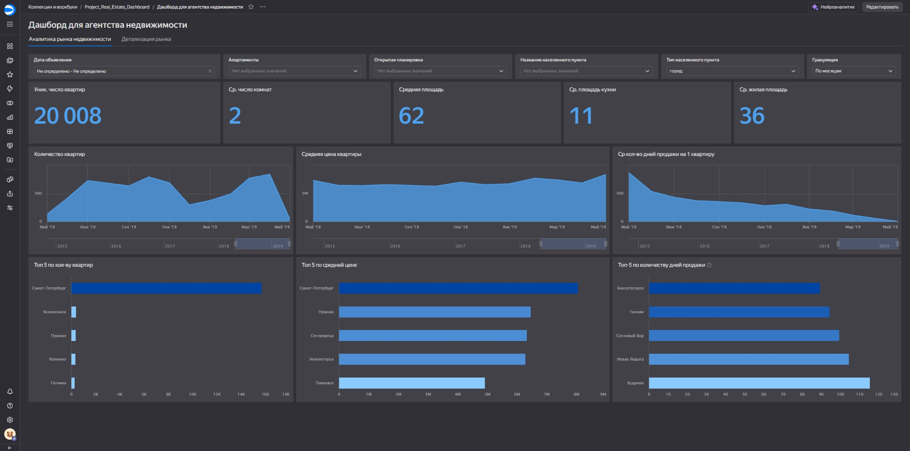
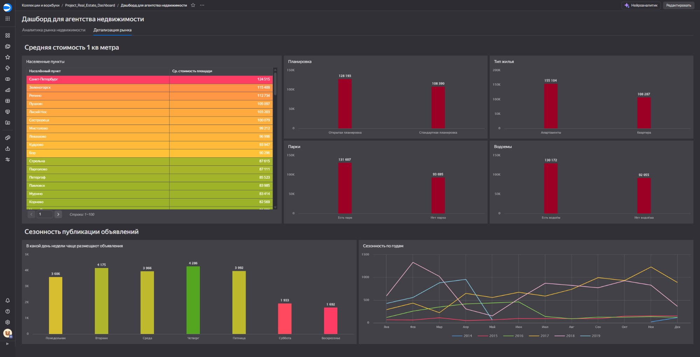

# 🏢 Анализ рынка недвижимости Санкт-Петербурга и Ленинградской области

Проект по анализу рынка вторичной недвижимости СПб и ЛенОбл на основе данных объявлений 2014–2019 гг.  
Включает исследовательский SQL-анализ и интерактивный дашборд в Yandex DataLens.

---

## 📊 Дашборд

### Аналитика рынка недвижимости


### Детализация рынка


🔗 **[Открыть дашборд в DataLens](https://datalens.yandex/ab1f2h9nad3ou)**

---

## 📁 Структура репозитория

```
├── queries.sql              # SQL-запросы и аналитика
├── screenshots/
├── dashboard_market_analytics.png   # Вкладка «Аналитика рынка»
├── dashboard_market_detail.png      # Вкладка «Детализация рынка»
└── README.md
```

---

## 🗄️ Данные

**Схема:** `real_estate`  
**Таблицы:**

| Таблица | Описание |
|---|---|
| `advertisement` | Объявления: цена, дата публикации, срок активности |
| `flats` | Характеристики квартир: площадь, комнаты, этаж, балкон, потолки |
| `city` | Справочник населённых пунктов |
| `type` | Справочник типов населённых пунктов (город / посёлок) |

**Период данных:** 2014–2019 гг.  
**Объём:** 20 008 уникальных квартир

---

## 🔍 Анализ

### Задача 1 — Время активности объявлений

Объявления разбиты на 4 категории по сроку активности: `1-30 дней`, `31-90 дней`, `91-180 дней`, `181+ дней`.  
Анализ по двум регионам: **Санкт-Петербург** и **Ленинградская область**.

**Ключевые выводы:**

- Рынок медленный: 31% объявлений в обоих регионах висят дольше полугода. Быстрые продажи (до 30 дней) — лишь 12–16%.
- Самый ликвидный сегмент — 1–2-комнатные квартиры до 55 м² на средних этажах с балконом.
- СПб дороже ЛенОбл в 1.5–1.7 раза (108–136 тыс. руб./м² против 67–73 тыс. руб./м²).
- В ЛенОбл первый этаж — значимый тормоз продажи (21% долгих объявлений против 14.7% быстрых).

---

### Задача 2 — Сезонность объявлений

Анализ по месяцам публикации и снятия объявлений за 2015–2018 гг. (полные годы).

**Ключевые выводы:**

- Пик публикаций — **октябрь–ноябрь** (10–11%). Минимум — **январь** (5.2%).
- Пик снятий (продаж) — **октябрь** (11.3%), но летом покупатели заметно активнее: июль–август дают ~9.5% снятий при скромных публикациях.
- **Февраль** обманчив: много новых объявлений, но спроса мало — большинство провисят до осени.
- Цена за м² практически не зависит от сезона (разброс ~8% за год).

---

## 🛠️ Технологии


- **PostgreSQL** — хранение данных и аналитические запросы (CTE, оконные функции, перцентили)
- **Yandex DataLens** — интерактивная визуализация с фильтрами по дате, типу жилья, населённому пункту
